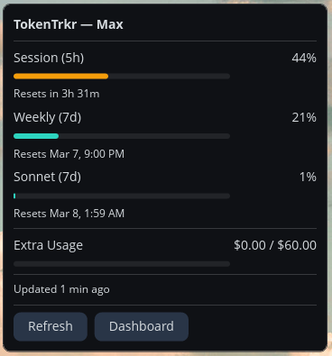

# TokenTrkr

System tray app that tracks your Claude token usage on Linux. Works as a **native COSMIC panel applet** on Pop!_OS/COSMIC, or as a **StatusNotifierItem tray icon** on KDE, GNOME, and other DEs.

 

### COSMIC Panel Applet



## What it does

TokenTrkr reads your Claude OAuth credentials, polls the usage API, and shows your current session usage as a bold number on a color-coded circle in the system tray. The icon color changes by usage bucket:

- **0–25%** → Teal
- **26–50%** → Amber
- **51–75%** → Orange
- **76–90%** → Red
- **91–100%** → Dark Red

Click the tray icon to see:

```
TokenTrkr — Max Plan
─────────────────
Session (5h)
  ▓▓░░░░░░░░░░  13%
  Resets in 3h 57m
─────────────────
Weekly (7d)
  ▓▓░░░░░░░░░░  18%
  Resets Mar 7, 9:00 PM
─────────────────
Sonnet (7d)
  ░░░░░░░░░░░░  1%
  Resets Mar 8, 2:00 AM
─────────────────
Extra Usage     $0.00 / $60.00
  ░░░░░░░░░░░░
─────────────────
Updated just now
─────────────────
Refresh Now
Open Dashboard
Quit
```

## Requirements

- Linux (COSMIC, KDE Plasma, GNOME with AppIndicator extension, or any DE with SNI support)
- Claude CLI installed and authenticated (`~/.claude/.credentials.json` must exist)
- Rust toolchain (to build)

## Install

### SNI Tray (all Linux DEs)

```bash
git clone https://github.com/goldengod503/tokentrkr.git
cd tokentrkr
cargo build --release
```

The binary is at `target/release/tokentrkr`.

### COSMIC Panel Applet (Pop!_OS / COSMIC)

Build with the `cosmic` feature for a native panel applet with popup UI:

```bash
cargo build --release --features cosmic
```

Install the applet:

```bash
# Put the binary in PATH
sudo cp target/release/tokentrkr /usr/bin/

# Install the desktop entry for COSMIC panel discovery
sudo cp resources/com.github.goldengod503.TokenTrkr.desktop /usr/share/applications/

# Restart the panel to pick up the new applet
pkill cosmic-panel
```

Then add **TokenTrkr** to your panel via COSMIC Settings > Desktop > Panel > Applets.

The app auto-detects which desktop you're running — on COSMIC it launches the native applet, elsewhere it falls back to the SNI tray icon.

### Autostart (SNI mode)

Copy the desktop file to your autostart directory:

```bash
cp tokentrkr.desktop ~/.config/autostart/
```

Edit the `Exec=` line to point to the full path of the binary.

## Configuration

Config lives at `~/.config/tokentrkr/config.toml` (created with defaults on first run):

```toml
[general]
poll_interval_minutes = 5

[claude]
source = "oauth"
# credentials_path = "~/.claude/.credentials.json"  # override

[display]
show_percent = "used"     # "used" or "remaining"
show_tertiary = true      # show Sonnet usage window
```

## How it works

1. Reads OAuth tokens from `~/.claude/.credentials.json` (written by Claude CLI)
2. Refreshes the access token if expired
3. Calls the Claude usage API to get session (5h), weekly (7d), and Sonnet utilization
4. Renders a 256x256 tray icon — usage percentage number on a color-coded circle (rendered with DejaVu Sans Bold via ab_glyph)
5. Repeats on a configurable interval

## License

MIT
