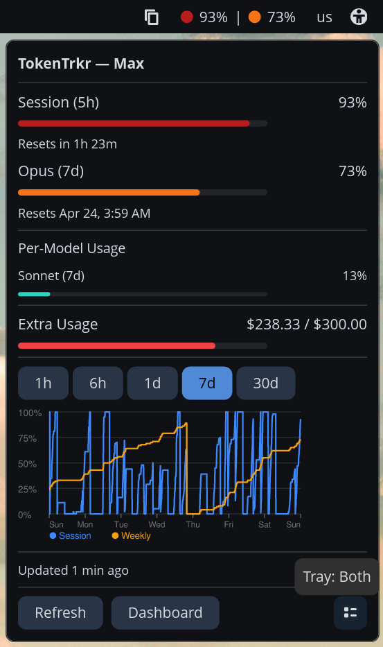
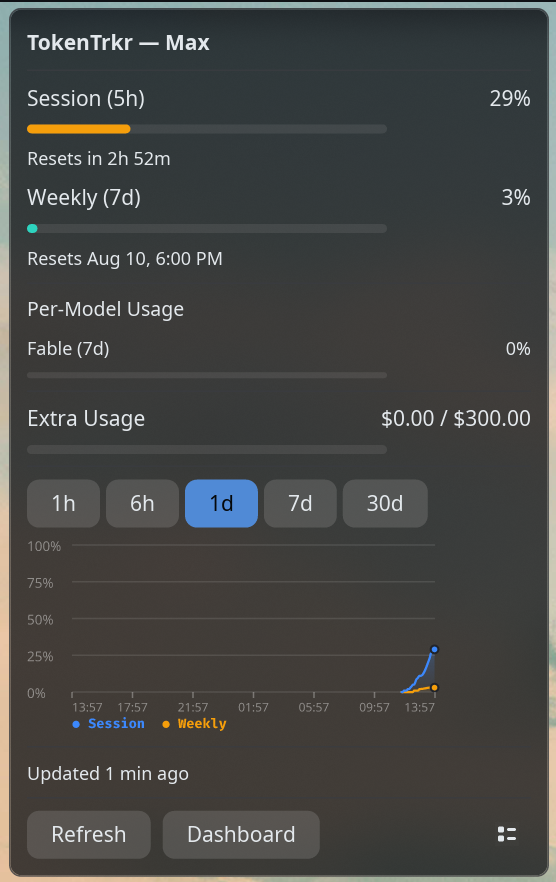

# TokenTrkr

System tray app that tracks your Claude token usage on Linux. Works as a **native COSMIC panel applet** on Pop!_OS/COSMIC, or as a **StatusNotifierItem tray icon** on KDE, GNOME, and other DEs.

 

### COSMIC Panel Applet

 

Features a color-coded dot + percentage in the panel, click-to-open popup with progress bars, usage history chart, and a spinning refresh indicator when fetching usage data. Toggle the tray to show **Session**, **Weekly**, or **Both** windows side-by-side. The popup renders as **frosted glass** — translucent with compositor-side background blur — when you have frosted glass enabled in COSMIC Settings.

## What it does

TokenTrkr reads your Claude OAuth credentials, polls the usage API, and shows your current session usage as a bold number on a color-coded circle in the system tray. The icon color changes by usage bucket:

- **0–25%** → Teal
- **26–50%** → Amber
- **51–75%** → Orange
- **76–90%** → Red
- **91–100%** → Dark Red

Click the tray icon to see:

**COSMIC applet popup:**
- Session (5h) and Opus (7d) progress bars with reset timers
- Per-model breakdown (Sonnet, Opus, Cowork — shown when API returns data)
- Extra usage billing tracker
- Usage history line chart with selectable time ranges (1h / 6h / 1d / 7d / 30d)
- Refresh, Dashboard, and a tray-mode toggle (cycles Session → Weekly → Both) — persists across restarts
- Frosted-glass popup background that follows your COSMIC frosted-glass setting

**SNI tray menu (KDE, GNOME, etc.):**
```
TokenTrkr — Max Plan
─────────────────
Session (5h)
  ▓▓░░░░░░░░░░  13%
  Resets in 3h 57m
─────────────────
Opus (7d)
  ▓▓░░░░░░░░░░  18%
  Resets Mar 7, 9:00 PM
─────────────────
Per-Model Usage
  Sonnet (7d) ░░░░░░░░  1%
─────────────────
Extra Usage     $0.00 / $60.00
  ░░░░░░░░░░░░
─────────────────
Updated just now
─────────────────
Refresh Now
Open Dashboard
Quit
```

## Requirements

- Linux (COSMIC, KDE Plasma, GNOME with AppIndicator extension, or any DE with SNI support)
- Claude CLI installed and authenticated (`~/.claude/.credentials.json` must exist)
- Rust toolchain (to build)

## Install

### SNI Tray (all Linux DEs)

```bash
git clone https://github.com/goldengod503/tokentrkr.git
cd tokentrkr
cargo build --release --no-default-features
```

The binary is at `target/release/tokentrkr`.

`--no-default-features` matters: the `cosmic` feature is **on by default**, so
a plain `cargo build --release` produces the COSMIC applet, not the SNI tray.
Both targets write the same path, so whichever you build last owns
`target/release/tokentrkr`.

### COSMIC Panel Applet (Pop!_OS / COSMIC)

The `cosmic` feature is on by default, so a plain release build gives you the
native panel applet with popup UI:

```bash
cargo build --release
```

Install the applet — build, copy the binary and desktop entry into `~/.local`,
and restart the panel, in one step:

```bash
just restart
```

Or without `just`:

```bash
cargo build --release
install -Dm755 target/release/tokentrkr ~/.local/bin/tokentrkr
install -Dm644 resources/com.github.goldengod503.TokenTrkr.desktop \
    ~/.local/share/applications/com.github.goldengod503.TokenTrkr.desktop
pkill cosmic-panel
```

Then add **TokenTrkr** to your panel via COSMIC Settings > Desktop > Panel > Applets.

**Install the binary — don't symlink `~/.local/bin/tokentrkr` at
`target/release/tokentrkr`.** Both build targets write that one path, so a later
`just build-sni` would silently replace your running panel applet with the SNI
tray, and `cargo clean` would delete it outright. `just install` copies instead,
which decouples the installed applet from the build tree. `install` unlinks the
destination before writing, so it is safe to run while the applet is live — the
running process keeps its old inode until the panel restarts.

`~/.local/bin` must be on your `PATH` for the desktop entry's `Exec=tokentrkr`
to resolve; it is by default on most distributions. To install system-wide
instead, copy to `/usr/bin` and `/usr/share/applications/` with `sudo`.

The app auto-detects which desktop you're running — on COSMIC it launches the native applet, elsewhere it falls back to the SNI tray icon.

### Autostart (SNI mode)

The entry in `resources/` is a COSMIC applet declaration (`X-CosmicApplet=true`,
`NoDisplay=true`) — the panel launches it, so it is not an autostart file. For
SNI mode, write your own:

```bash
install -Dm755 target/release/tokentrkr ~/.local/bin/tokentrkr
cat > ~/.config/autostart/tokentrkr.desktop <<'EOF'
[Desktop Entry]
Type=Application
Name=TokenTrkr
Exec=tokentrkr
Terminal=false
EOF
```

Use the full path in `Exec=` if `~/.local/bin` is not on your session's `PATH`.

## Configuration

Config lives at `~/.config/tokentrkr/config.toml` (created with defaults on first run):

```toml
[general]
poll_interval_minutes = 5

[claude]
source = "oauth"
# credentials_path = "~/.claude/.credentials.json"  # override

[display]
show_percent = "used"     # "used" or "remaining"
show_tertiary = true      # show Sonnet usage window
tray_mode = "session"     # "session" | "weekly" | "both" — controls what the panel shows
```

## Feature comparison

| Feature | COSMIC Applet | SNI Tray |
|---|---|---|
| Status bar indicator | Color dot + percentage | Color-coded icon |
| Session & weekly usage | Progress bars | Text + block bars |
| Per-model breakdown | Progress bars | Text + block bars |
| Extra usage tracking | Progress bar | Text + block bar |
| Usage history chart | Line chart (canvas) | — |
| Time range selector | 1h / 6h / 1d / 7d / 30d | — |
| Frosted-glass popup | Follows COSMIC frosted-glass setting | — |

### Frosted glass

The COSMIC popup is translucent with compositor-side background blur when
frosted glass is on. TokenTrkr adds no setting of its own — it follows
**COSMIC Settings → Appearance**, like the built-in applets do, reading the
same `frosted_applets` value. Turn frosting off there and the popup goes back
to an opaque background.

This needs a compositor that implements the `ext-background-effect-v1`
protocol; `cosmic-comp` does. The panel button is unaffected — it is already
transparent and inherits whatever the panel itself is doing (`frosted_panel`),
which is COSMIC's business, not TokenTrkr's.

## How it works

1. Reads OAuth tokens from `~/.claude/.credentials.json` (written by Claude CLI)
2. Refreshes the access token if expired
3. Calls the Claude usage API to get session (5h), Opus (7d), and per-model utilization (Sonnet, Cowork, etc.)
4. Records usage history to `~/.config/tokentrkr/history.json` (30-day retention)
5. Renders a 256x256 tray icon — usage percentage number on a color-coded circle (rendered with DejaVu Sans Bold via ab_glyph)
6. Repeats on a configurable interval

## License

MIT for the TokenTrkr source. The bundled `assets/DejaVuSans-Bold.ttf` is
distributed under the Bitstream Vera Fonts License — see `LICENSE-DEJAVU.txt`.
